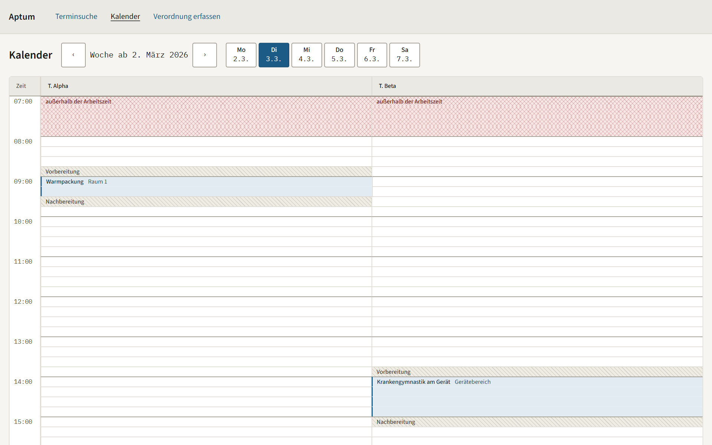
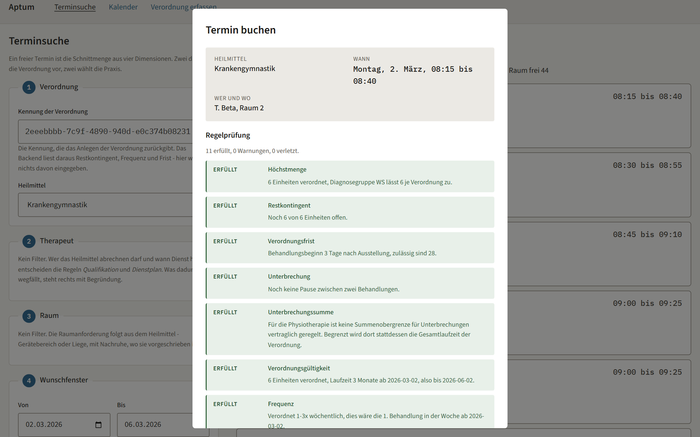
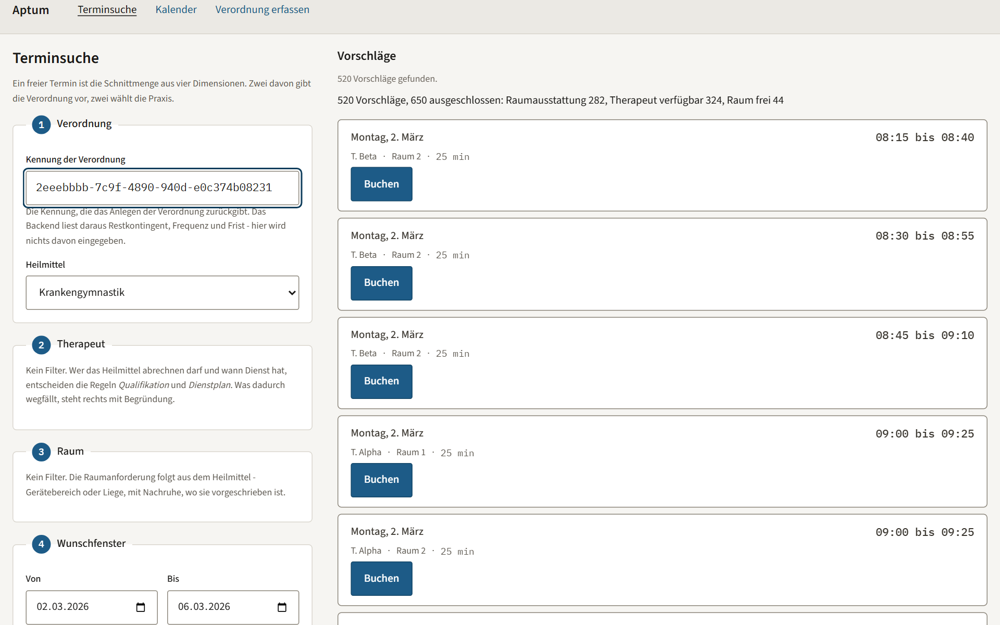
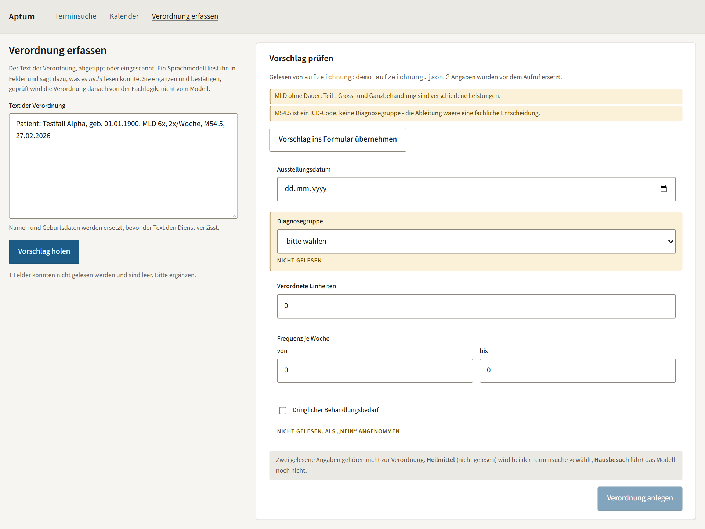

# Aptum

Terminplanung und Verordnungsverwaltung für Physio- und Ergotherapiepraxen.

Ein Portfolio-Projekt mit einem Auftraggeber aus Papier: zwei Ausschreibungen
für Full-Stack-Entwicklung mit Angular, Java, KI-Anbindung und Cloud-Betrieb.
Jede ihrer Anforderungen steht wörtlich in
[docs/ANFORDERUNGEN.md](docs/ANFORDERUNGEN.md), mit Status und dem Ort im Repo,
an dem sie nachprüfbar eingelöst ist — auch die, die ein Portfolio nicht
einlösen kann. Das ist die Tabelle, die man zuerst lesen sollte.

*Aptum*, lateinisch für „passend". Die Anwendung beantwortet eine einzige
Frage: Passt dieser Termin zu Therapeut, Raum, Patient **und** Verordnung? Die
vier Dimensionen unten sind der Grund für den Namen.

## Was läuft

**Stand 12. September 2026, Stufen 0 bis 4 abgeschlossen.** Drei Dienste,
ein Befehl, eine Regelprüfung für alles:

- **Scheduling-Dienst (Java 21, Spring Boot 3.5).** Der Domänenkern kennt kein
  Framework — ArchUnit prüft das. 65 Fachregeln aus Heilmittel-Richtlinie und
  Verträgen sind mit Fundstelle dokumentiert, elf davon als benannte
  Regelklassen mit parametrisierten Grenzfalltests umgesetzt; keine Fachzahl
  steht im Code ohne ihre Fundstelle (ADR-007). Die Slot-Suche schneidet Therapeut, Raum, Patient und Verordnung und sagt, was
  sie aus welchem Grund weggelassen hat. Mandanten trennt Postgres per Row
  Level Security, bewiesen gegen eine echte Datenbank (ADR-002).
- **AI-Dienst (Python 3.12, FastAPI).** Liest eine Verordnung aus Freitext,
  nachdem Namen und Geburtsdaten ersetzt sind, und sagt, was er *nicht* lesen
  konnte, statt zu raten. Zwei Provider, eine Eval-Suite mit 55 Fällen, ein
  MCP-Server mit vier Werkzeugen. Kein Vorschlag wird gebucht, ohne dieselbe
  Regelprüfung zu durchlaufen wie eine manuelle Buchung.
- **Frontend (Angular 20).** Terminsuche, Buchungsdialog mit der Regelprüfung
  als benannter Liste, ein selbst gebautes Kalender-Grid mit Roving Tabindex
  (ADR-003), Verordnungserfassung. axe-core im Unit-Test und im echten Browser.
- **Betrieb.** `docker compose up` für den Schreibtisch; Terraform, ArgoCD und
  Helm für den Cluster — die CI fährt das bei jedem Push in `kind` (ADR-010).

| | |
|---|---|
|  |  |
| Das Kalender-Grid: Rüstzeit, Nachruhe und Sperrzeiten als eigene Zustände, jede Zelle mit Namen für Screenreader | Der Buchungsdialog: dieselben Regeln, die die Suche befragt hat, als Liste — bevor jemand entscheidet |
|  |  |
| Die Terminsuche zählt, was sie weggelassen hat, und warum | Die Erfassung: das Modell liest, was es lesen kann, und schweigt beim Rest. Der Mensch ergänzt, die Domäne prüft |

Was hier behauptet wird, ist an der jeweiligen Stelle im Repo nachprüfbar oder
als offen gekennzeichnet — und ein CI-Job prüft die Belege mit
([unten](#was-hier-nachprüfbar-ist)).

---

## Das Domänenproblem

Ein freier Termin ist keine Lücke im Kalender. Er ist die Schnittmenge über vier
Dimensionen:

1. **Therapeut** — Arbeitszeit minus Abwesenheiten minus gebuchte Termine,
   gefiltert nach Qualifikation. Manuelle Lymphdrainage darf nicht jeder
   abrechnen.
2. **Raum** — Ausstattung und Belegung. Krankengymnastik am Gerät braucht einen
   Bereich von mindestens 30 m² mit vier Pflichtgeräten.
3. **Patient** — Wunschfenster.
4. **Verordnung** — Fristen, Frequenz, Restkontingent.

Dazu Rüstzeiten zwischen Behandlungen, Nachruhezeiten, die den Raum blockieren
aber nicht die Therapeutin, und Serientermine mit Ausnahmen für Feiertage,
Krankmeldungen und Einzelverschiebungen.

Die Regeln sind nicht erfunden. Sie stehen in der Heilmittel-Richtlinie und in
den Verträgen nach § 125 SGB V. Zwei Beispiele, an denen sichtbar wird, warum
das kein CRUD ist:

- Eine Verordnung verfällt, wenn die Behandlung nicht innerhalb von 28
  Kalendertagen nach Ausstellung beginnt, bei gekennzeichnetem dringlichem
  Bedarf innerhalb von 14.
- Eine Unterbrechung von mehr als 14 Kalendertagen lässt die Verordnung
  verfallen, außer sie ist begründet. In der Ergotherapie summieren sich
  begründete Unterbrechungen auf maximal 70 Tage. In der Physiotherapie gibt es
  diese Summengrenze nicht, dafür verfällt die Verordnung dort absolut nach drei
  oder sechs Monaten ab dem ersten Behandlungstag.

Diese Asymmetrie zwischen zwei Therapieformen in derselben Praxis ist genau die
Art Fachlogik, die sich nicht in ein Formular schreiben lässt.

Belegt und mit Fundstellen: [`.claude/skills/heilmittel-domain/regeln.md`](.claude/skills/heilmittel-domain/regeln.md)

## Die Architekturregel

> Der AI-Layer schlägt vor, die Domäne entscheidet.

Kein Vorschlag eines Sprachmodells wird gebucht, ohne dieselbe deterministische
Regelprüfung zu durchlaufen wie eine manuelle Buchung. In dieser Domäne ist ein
Modell nie die letzte Instanz.

## Was hier nachprüfbar ist

Dieses Repo behauptet eine Arbeitsweise. Der CI-Job
[`beleg-check`](scripts/beleg-check.sh) macht aus jeder Behauptung eine Zusage,
die kaputtgehen kann: Er prüft bei jedem Lauf, dass die Anforderungen erfasst
sind, jede Entscheidung als ADR mit Alternativen und Konsequenzen vorliegt, die
Skills im Repo statt in einer globalen Konfiguration liegen, und der
KI-Einsatz protokolliert wird.

Fehlt ein Beleg, wird die CI rot. Entweder der Beleg wird nachgeliefert, oder
die Behauptung gestrichen.

Daneben stehen vier weitere Gates: die Kontrastprüfung aus den Farbtoken, ein
Verweis-Check über die Markdown-Querverweise, eine Prosa-Prüfung gegen
ausgeschriebene Umlaute und der Regel-Check, der keine Fachzahl ohne belegte
Fundstelle in den Domänencode lässt. Alle fünf laufen auch vor dem Commit auf
der eigenen Maschine. Wie sie zugeschnitten sind und was sie *nicht* abfangen, steht in
[docs/PIPELINE.md](docs/PIPELINE.md).

## Starten

Ein Befehl, vier Container:

```bash
docker compose up --build
```

Danach läuft alles unter [http://localhost:8000](http://localhost:8000):
das Frontend, dahinter der Scheduling-Dienst (Java) und der AI-Dienst (Python),
darunter ein Postgres mit Row Level Security. nginx liefert die Anwendung aus
und reicht `/api` an die beiden Dienste weiter. Ohne Schlüssel antwortet der
AI-Dienst aus einer Aufzeichnung; mit Schlüssel:

```bash
ANTHROPIC_API_KEY=sk-ant-... AI_ASSIST_PROVIDER=anthropic docker compose up
```

Die Startreihenfolge ist eine Bedingung, keine Hoffnung: Jeder Dienst wartet,
bis der, den er braucht, gesund gemeldet hat. Die Anwendungsrolle `aptum_app`
legt `deploy/postgres/01-rolle.sql` beim ersten Start an — eine Rolle ohne
Rechte an den Tabellen, sonst griffe Row Level Security nicht (ADR-002).
Flyway migriert als `aptum`. Kein Prozess läuft als Root.

Die Schnittstelle ist auch direkt erreichbar, mit dem Mandanten in der
Kopfzeile — ein Platzhalter, siehe [OFFENE-PUNKTE.md](docs/OFFENE-PUNKTE.md),
Punkt 8:

```bash
H='-H Content-Type:application/json -H X-Mandant:praxis-a'
curl $H -d '{"ausstellungsdatum":"2026-02-27","dringlicherBedarf":false,"diagnosegruppe":"WS",
             "verordneteEinheiten":6,"frequenzMin":1,"frequenzMax":3}' localhost:8080/verordnungen
curl $H -d '{"verordnung":"<id>","heilmittel":"KG_EINZEL","von":"2026-03-02","bis":"2026-03-04",
             "fruehestens":"09:00","spaetestens":"11:00","wochentage":["MONDAY","TUESDAY"]}' localhost:8080/termine/suche
curl $H -d '{"verordnung":"<id>","heilmittel":"KG_EINZEL","therapeut":"T. Alpha","raum":"Raum 1",
             "beginn":"2026-03-02T09:00:00+01:00"}' localhost:8080/termine
curl -H X-Mandant:praxis-a 'localhost:8080/kalender/woche?tag=2026-03-04'
```

Die Suche antwortet mit Vorschlägen und der Zählung der Ausschlüsse je Regel.
Die zweite Buchung desselben Termins antwortet mit `409` und nennt die
verletzten Regeln; dieselbe Anfrage mit `X-Mandant: praxis-b` antwortet mit
`404`, weil die Verordnung für diesen Mandanten nicht existiert.

Für die Entwicklung ohne Container: `mvn` im Scheduling-Dienst, `uv run` im
AI-Dienst, `npm start` im Frontend — die READMEs der Verzeichnisse sagen wie.

Dasselbe in Kubernetes, lokal mit `kind` — und zwar so, wie es die CI bei
jedem Push tut (ADR-010): Terraform stellt ArgoCD, ArgoCD rollt aus dem Repo
aus.

```bash
docker compose build
kind create cluster --config deploy/kind/cluster.yaml
for i in scheduling ai-assist frontend; do kind load docker-image aptum-$i:latest --name aptum; done
(cd deploy/terraform/plattform && terraform init && terraform apply)   # Namespace, ArgoCD
(cd deploy/terraform/anwendung && terraform init && terraform apply)   # die Application
kubectl get application aptum -n argocd -o jsonpath='{.status.sync.status} {.status.health.status}'
```

Sobald dort `Synced Healthy` steht, hat ArgoCD das Chart aus `main`
ausgerollt. Der Rauchtest läuft als Pod im Cluster und fragt durch den
Reverse Proxy alle drei Dienste — grün heißt, die Kette steht, so wie ArgoCD
sie gebaut hat:

```bash
helm template aptum deploy/helm/aptum --show-only templates/tests/rauchtest.yaml | kubectl apply -n aptum -f -
kubectl logs -n aptum aptum-rauchtest -f
```

Wer nur das Chart prüfen will, ohne ArgoCD: `helm install aptum deploy/helm/aptum --wait && helm test aptum --logs`.

## Wegweiser

| Datei | Inhalt |
|---|---|
| [docs/ANFORDERUNGEN.md](docs/ANFORDERUNGEN.md) | Die Anforderungen wörtlich, mit Status und Beleg. Auch die Punkte, die nicht belegbar sind. |
| [docs/PRODUKT.md](docs/PRODUKT.md) | Für wen gebaut wird, was zuerst kommt, was bewusst nicht gebaut wird |
| [DECISIONS.md](DECISIONS.md) | Übersicht der Architekturentscheidungen |
| [docs/adr/](docs/adr/) | Die Entscheidungen im Volltext, mit Alternativen und dem Abschnitt "wann wir anders entscheiden würden" |
| [docs/PIPELINE.md](docs/PIPELINE.md) | Die Gates zwischen einer Änderung und `main` — und was sie nicht abfangen |
| [docs/ENTWICKLUNGSLOG.md](docs/ENTWICKLUNGSLOG.md) | Beobachtungen zum KI-Einsatz, ehrlich auch da wo es nicht gut aussieht |
| [docs/DATENSCHUTZ.md](docs/DATENSCHUTZ.md) | Regeln für Testdaten und was in einer echten Anwendung zu klären wäre |
| [docs/BETRIEB.md](docs/BETRIEB.md) | Wie es läuft und ausgerollt wird, was ein Betrieb erfährt — und was bewusst nicht gebaut ist |
| [CLAUDE.md](CLAUDE.md) | Die Projektregeln auf einer Bildschirmseite |
| [.claude/](.claude/) | Skills, Commands und Subagents, versioniert im Repo |

## Stand der Stufen

| Stufe | Inhalt | Stand |
|---|---|---|
| 0 | Setup, Regeln, Skills, CI-Grundgerüst, ADR-001 | **erledigt** |
| 1 | Domänenkern in reinem Java, dann Spring, Multi-Tenancy, Angular-Suchflow | **abgeschlossen** — Domänenkern mit Slot-Suche, Spring Boot in drei Modulen, RLS gegen echtes Postgres, REST mit OpenAPI, Terminsuche in Angular |
| 2 | Kalender-Grid, Tabelle, WCAG, End-to-End-Tests | **in Arbeit** — Kalender-Grid, Buchungsdialog mit Regelprüfung, Playwright mit axe als CI-Job; Verordnungsübersicht und Tabelle offen |
| 3 | AI-Layer, MCP-Server, Evals, Provider-Vergleich | **in Arbeit** — Verordnungserfassung aus Freitext in `services/ai-assist/` (Python), Pseudonymisierung vor dem Aufruf, zwei Provider, Eval-Suite mit 55 Fällen in `evals/`, MCP-Server mit vier Werkzeugen, Seite „Verordnung erfassen“; Provider-Vergleich offen |
| 4 | Container, Helm, ArgoCD, Terraform, Observability | **abgeschlossen, soweit ein Portfolio es kann** — drei Dienste als Container, `compose.yml` fährt alles mit einem Befehl hoch; Terraform in zwei Ständen stellt ArgoCD, ArgoCD rollt das Helm-Chart aus dem Repo aus, die CI fährt das bei jedem Push in einem `kind`-Cluster (ADR-010); getrennte Probes, JSON-Protokoll mit Mandanten-ID. Was ein Betrieb darüber hinaus bräuchte, benennt `docs/BETRIEB.md` |
| 5 | Demo, ADRs vervollständigen, Mapping | **in Arbeit** — Mapping gegen das Repo abgeglichen, Demodaten und Bilder im README; Abrechnungsübersicht und Verordnungssicht folgen |

## Daten

Ausschließlich klar erkennbare Testdaten. Keine realistisch aussehenden
Patientennamen, keine echten Verordnungen. Details in
[docs/DATENSCHUTZ.md](docs/DATENSCHUTZ.md).
